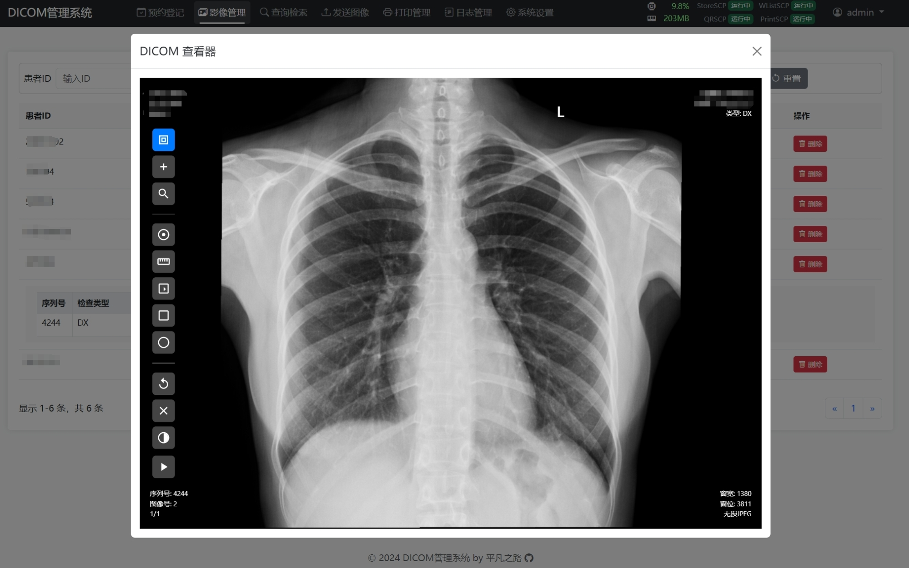
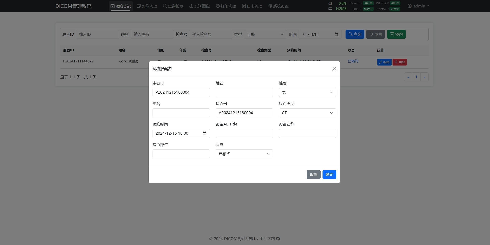
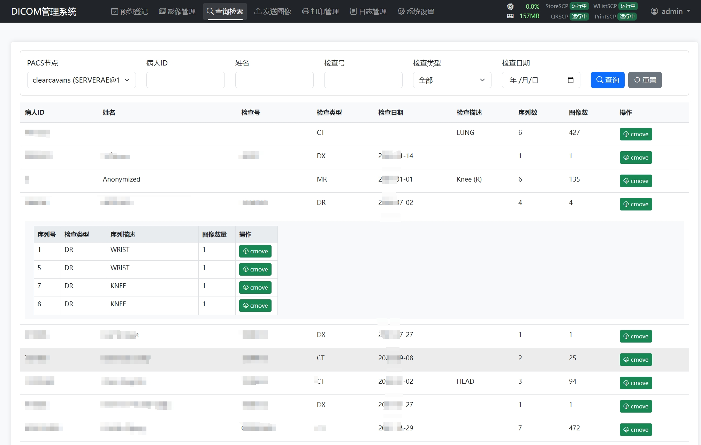
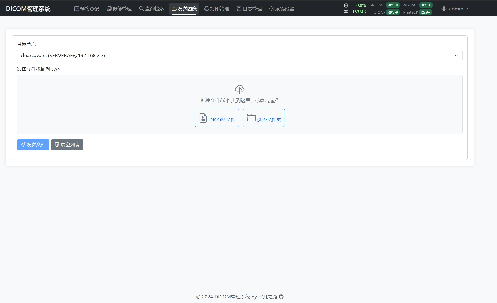
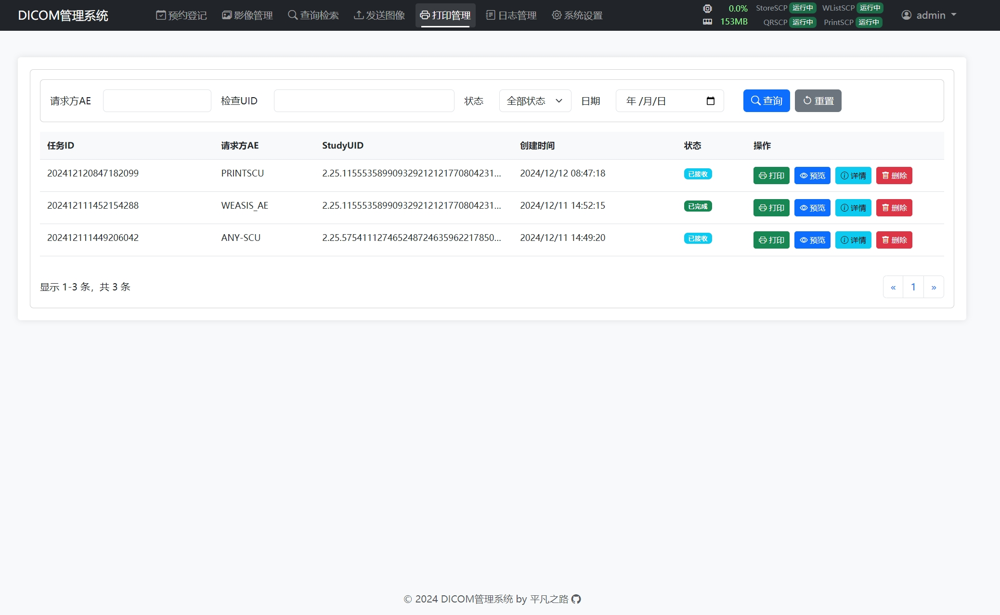
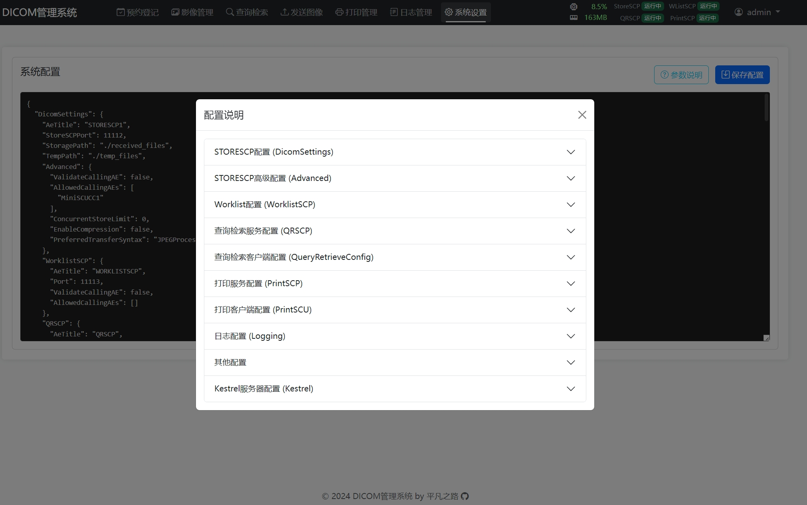
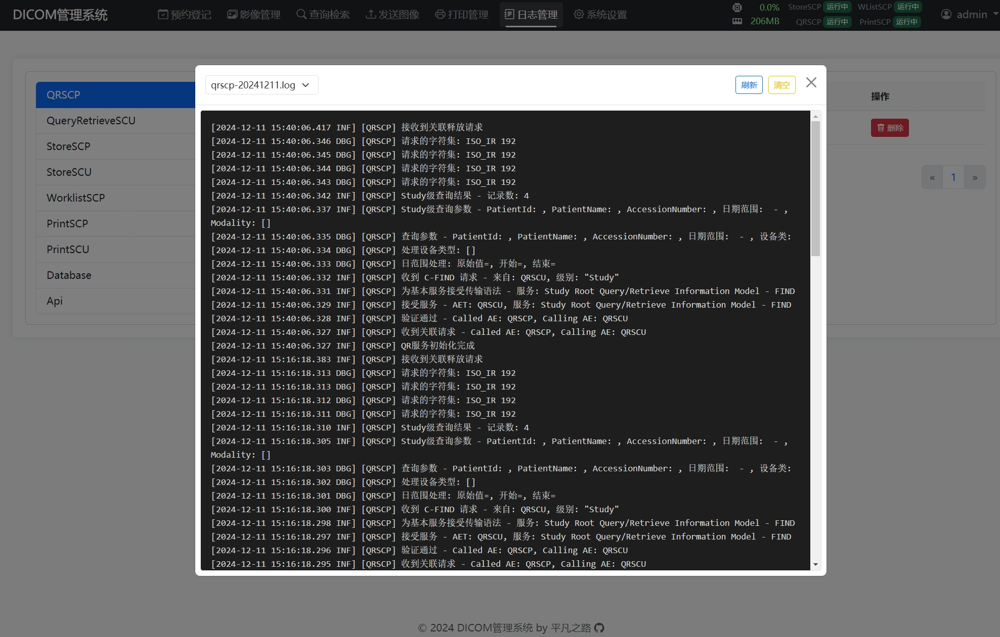
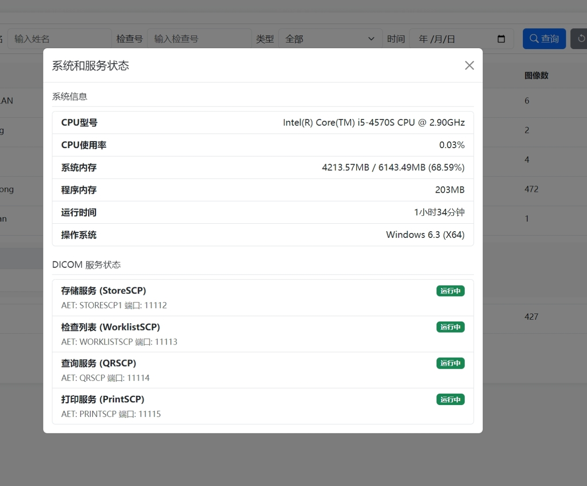

# DICOM 管理系统

## 携手CURSOR重磅发布，打造中文开源社区最完善的DICOM工具箱!
基于 .NET Core 的 DICOM SCP（Service Class Provider）服务器，提供 DICOM 存储、工作列表、查询检索服务，打印服务，并集成了 Web 端 DICOM 查看器。

  
  
  
 
  
  
 
 
 

## 功能特性

### DICOM 服务
- **存储服务 (C-STORE SCP)**
  - 支持多种传输语法和压缩格式
  - 可配置并发存储限制
  - 自动组织存储目录结构
  - 支持 JPEG、JPEG2000、JPEG-LS RLE 等压缩

- **工作列表服务 (Worklist SCP)**
  - 提供标准 DICOM Modality Worklist 服务
  - 支持多种查询条件（患者ID、检查号、日期等）
  - 支持请求字符集协商自动中英文转换

- **查询检索服务 (QR SCP)**
  - 提供 C-FIND、C-MOVE、C-GET 服务
  - 可配置多个目标节点
  - 支持多种查询级别（Study/Series/Image）
  - 支持JPEG、JPEG2000、JPEG-LS RLE 传输语法实时转码

- **打印服务 (Print SCP)**
  - 打印任务队列管理
  - 支持多种打印格式
  - 打印任务状态跟踪

## 系统要求

- Windows 10/11 或 Windows Server 2016+
- .NET 8.0 或更高版本
- SQLite 3.x
- 2GB+ RAM
- 1GB+ 可用磁盘空间
- 现代浏览器（Chrome/Firefox/Edge）

## 快速开始

1. 下载最新发布版本
2. 修改 appsettings.json 配置文件
3. 运行 DicomSCP.exe
4. 访问 http://localhost:5000
5、默认账号 admin / admin

## 技术栈

- 后端框架：.NET Core
- 前端框架：原生 JavaScript
- DICOM 处理：fo-dicom、Cornerstone.js
- 数据库：SQLite
- HTTP 客户端：Axios
- UI 组件：Bootstrap

## 许可证

MIT License
