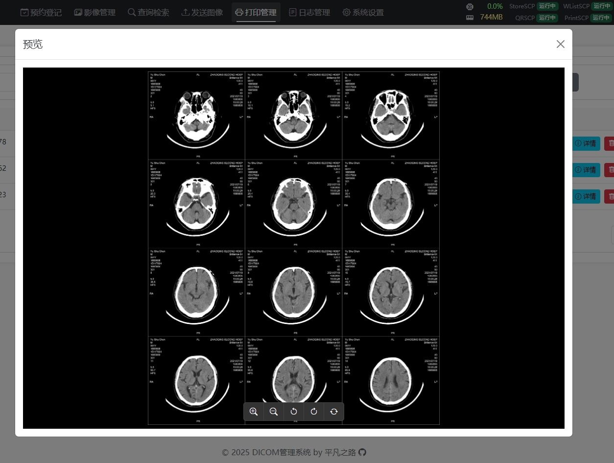

# DICOM Management System

## Introducing the most comprehensive lightweight PACS system in the Chinese open-source community, in collaboration with Cursor! A must-have DICOM toolbox for medical imaging!

- A DICOM SCP (Service Class Provider) server based on .NET Core, providing DICOM storage, worklist, query/retrieve services, print services, WADO/DicomWeb services, and integrated powerful DICOM desktop and web viewers.

- The project supports cross-platform usage. For Windows, simply download the release version and run it. For Linux, use [Docker deployment](#docker部署). Note that Weasis viewer requires installation on the client computer to function.

- It is recommended to use [Docker deployment](#docker部署) for automatic image updates. Other versions can be built by pulling the dev branch, with releases published periodically.

- This project is powered by passion. The author, a long-time medical imaging professional, aims to provide a lightweight DICOM solution for Chinese medical imaging. Usage is unrestricted, but please adhere to the [MIT License](LICENSE).

- This is a personal project intended for reference and learning. It has not undergone extensive testing. Issues can be reported, and bugs will be fixed as time permits.

- The project is positioned as a lightweight PACS, focusing on DICOM processing without adding RIS-related content.

- [Project Gitee Repository](https://gitee.com/fightroad/DicomSCP)

- [Project GitHub Repository](https://github.com/fightroad/DicomSCP)

## Support the Project

If this project has been helpful to you, please consider sponsoring us to continue improving it!

<table>
  <tr>
    <td align="center">
      
      <br/>
      WeChat Sponsorship
    </td>
    <td align="center">
      
      <br/>
      Alipay Sponsorship
    </td>
  </tr>
</table>

Your support will help us:
- 🚀 Develop new features
- 🐛 Fix known issues
- 📚 Improve project documentation
- 🎨 Enhance user experience

Please include your Gitee/GitHub ID when sponsoring, and we will add you to the [sponsors list](#赞助者).

## Feature Preview





## Features

- **Storage Service (C-STORE SCP)**
  - Archive and organize by 4 levels of tags
  - Automatically organize storage directory structure by level tags
  - Support JPEG, JPEG2000, JPEG-LS, RLE compression
  - Handle non-standard character set Chinese character garbling

- **Worklist Service (Worklist SCP)**
  - Provide standard DICOM Modality Worklist service
  - Support multiple query conditions (patient ID, accession number, date, etc.)
  - Support request character set negotiation for automatic Chinese-English conversion

- **Query Retrieve Service (QR SCP)**
  - Provide C-FIND, C-MOVE, C-GET services
  - Configurable multiple target nodes
  - Support multiple query levels (Study/Series/Image)
  - Support real-time transcoding of JPEG, JPEG2000, JPEG-LS, RLE transfer syntax

- **Print Service (Print SCP)**
  - Print job queue management
  - Support multiple print formats
  - Track print job status
  - Archive original files and labels of prints

- **WADOURI Service (Web Access to DICOM Objects)**
  - Required parameters
    - `requestType`: Must be "WADO"
    - `studyUID`: Study Instance UID
    - `seriesUID`: Series Instance UID
    - `objectUID`: Instance UID

  - Optional parameters
    - `contentType`: Return content type, default is image/jpeg
      - `application/dicom`: Return DICOM format
      - `image/jpeg`: Return JPEG format

    - `transferSyntax`: DICOM transfer syntax UID, default is no transcoding
      - `1.2.840.10008.1.2`: Implicit VR Little Endian
      - `1.2.840.10008.1.2.1`: Explicit VR Little Endian
      - `1.2.840.10008.1.2.4.50`: JPEG Baseline
      - `1.2.840.10008.1.2.4.57`: JPEG Lossless
      - `1.2.840.10008.1.2.4.70`: JPEG Lossless SV1
      - `1.2.840.10008.1.2.4.90`: JPEG 2000 Lossless
      - `1.2.840.10008.1.2.4.91`: JPEG 2000 Lossy
      - `1.2.840.10008.1.2.4.80`: JPEG-LS Lossless
      - `1.2.840.10008.1.2.5`: RLE Lossless

    - `anonymize`: Whether to anonymize
      - `yes`: Perform anonymization
      - Other values or not provided: No anonymization

  - Complete request parameter example
    ```
    http://localhost:5000/wado?requestType=WADO&studyUID=1.2.840.113704.1.111.5096.1719875982.1&seriesUID=1.3.46.670589.33.1.13252761201319485513.2557156297609063016&objectUID=1.3.46.670589.33.1.39304787935332940.2231985654917411587&contentType=application/dicom&transferSyntax=1.2.840.10008.1.2.4.70&anonymize=yes
    ```

- **CSTORE-SCU (CSTORE-SCU)**
  - Support sending DICOM images to DICOM SCP
  - Configurable multiple target nodes

- **Print-SCU (Print-SCU)**
  - Support printing images received by PRINTSCP to other printers or PRINTSCP services
  - Construct print images while retaining original image tag information

- **Log Service**
  - Support viewing, downloading, and deleting logs
  - Independent configuration of each service log
  - Multiple log level configurations
  - Detailed logs preset for each service to facilitate troubleshooting

- **WADO-RS Service (Web Access to DICOM Objects - RESTful Services)**
  - Instance Retrieval
    ```
    GET /dicomweb/studies/{studyUID}
    GET /dicomweb/studies/{studyUID}/series/{seriesUID}
    GET /dicomweb/studies/{studyUID}/series/{seriesUID}/instances/{instanceUID}
    ```
    - Support raw DICOM format retrieval
    - Support transfer syntax conversion
    - Support multipart/related response
    - Support Accept header to specify return format
    - Support retrieval at study/series/instance levels
    - Support transfer-syntax parameter to specify transfer syntax

  - Metadata Retrieval
    ```
    GET /dicomweb/studies/{studyUID}/series/{seriesUID}/metadata
    ```
    - Return DICOM JSON format
    - Include complete DICOM tag information
    - Support standard format for VR and Value
    - Handle empty values according to DICOMweb standards

  - Frame Retrieval
    ```
    GET /dicomweb/studies/{studyUID}/series/{seriesUID}/instances/{instanceUID}/frames/{frames}
    ```
    - Support single/multiple frame extraction
    - Preserve original pixel data
    - Support transfer syntax conversion

  - Thumbnail Service
    ```
    GET /dicomweb/studies/{studyUID}/series/{seriesUID}/thumbnail?size={size}
    GET /dicomweb/studies/{studyUID}/series/{seriesUID}/thumbnail?viewport={viewport}
    ```
    - Support custom size
      - size: Specify output image size (optional, default 128)
      - viewport: Specify viewport size (optional, mutually exclusive with size parameter)
    - Maintain image aspect ratio
    - JPEG format output
    - Example:
      ```
      /dicomweb/studies/1.2.3/series/4.5.6/thumbnail?size=256
      /dicomweb/studies/1.2.3/series/4.5.6/thumbnail?viewport=512
      ```

- **QIDO-RS Service (Query based on ID for DICOM Objects - RESTful Services)**
  - Study Level Query
    ```
    # DICOMweb Standard Format
    GET /dicomweb/studies?00100020={patientID}&00100010={patientName}&00080020={date}&00200010={accessionNumber}&0020000D={studyUID}&00080060={modality}&offset={offset}&limit={limit}&fuzzy=true

    # Friendly Format (Compatible)
    GET /dicomweb/studies?PatientID={patientID}&PatientName={patientName}&StudyDate={date}&AccessionNumber={accessionNumber}&StudyInstanceUID={studyUID}&Modality={modality}&offset={offset}&limit={limit}&fuzzy=true
    ```
    - Supports various query parameters:
      - Standard DICOM Tag Format:
        - 00100020: Patient ID
        - 00100010: Patient Name
        - 00080020: Study Date
        - 00200010: Accession Number
        - 0020000D: Study Instance UID
        - 00080060: Modality
      - Friendly Format (Equivalent):
        - PatientID: Exact or fuzzy match (e.g., "P123*" matches all IDs starting with P123)
        - PatientName: Supports wildcards (e.g., "*Zhang*" matches names containing "Zhang")
        - StudyDate: Supports date range (e.g., "20240101-20240131" for January data)
        - AccessionNumber: Accession number match
        - StudyInstanceUID: Exact match for Study Instance UID
        - Modality: Modality (e.g., "CT" or "CT\MR" supports multiple values)
        - fuzzy: Enables fuzzy matching when set to true
    - Supports pagination (offset/limit)
    - Supports fuzzy matching
    - Returns JSON format compliant with DICOMweb standards

  - Series Level Query
    ```
    GET /dicomweb/studies/{studyUID}/series?SeriesInstanceUID={seriesUID}&Modality={modality}
    ```
    - Supports Series UID filtering
    - Supports modality filtering (e.g., "CT*" matches all CT-related modalities)
    - Returns series details
    - Compliant with DICOMweb JSON format

  - Instance Level Query
    ```
    GET /dicomweb/studies/{studyUID}/series/{seriesUID}/instances?SOPInstanceUID={instanceUID}
    ```
    - Supports SOP Instance UID filtering
    - Returns instance details
    - Includes image parameter information

## System Requirements

- Windows 10/11 or Windows Server 2016+
- .NET 8.0 or higher
- SQLite 3.x
- 4GB+ RAM
- 10GB+ available disk space
- Modern browser (Chrome/Firefox/Edge)

## Quick Start

1. Download the latest release
2. Modify the appsettings.json configuration file
3. Run DicomSCP.exe
4. Access http://localhost:5000
5. Default account: admin / admin

## Docker Deployment
Ensure appsettings.json is created in the host directory first!

```
docker run -d --name DicomSCP --restart unless-stopped \
  -p 5000:5000 \
  -p 11112-11115:11112-11115 \
  -v /opt/docker/dicomscp/keys:/root/.aspnet/DataProtection-Keys \
  -v /opt/docker/dicomscp/logs:/app/logs \
  -v /opt/docker/dicomscp/received_files:/app/received_files \
  -v /opt/docker/dicomscp/temp_files:/app/temp_files \
  -v /opt/docker/dicomscp/appsettings.json:/app/appsettings.json \
  -v /opt/docker/dicomscp/db:/app/db \
  fightroad/dicomscp:latest

```

## Nginx Reverse Proxy

```
proxy_pass http://127.0.0.1:5000;
proxy_set_header Host $host:$server_port;
proxy_set_header X-Forwarded-Proto $scheme;
proxy_set_header X-Real-IP $remote_addr;
proxy_set_header X-Forwarded-For $proxy_add_x_forwarded_for;
proxy_set_header REMOTE-HOST $remote_addr;
proxy_set_header Upgrade $http_upgrade;
proxy_set_header Connection "Upgrade";
proxy_http_version 1.1;
```
## Technology Stack

- Backend Framework: .NET Core
- Frontend Framework: Native JavaScript
- DICOM Processing: fo-dicom, Cornerstone.js
- Database: SQLite
- HTTP Client: Axios
- UI Components: Bootstrap

## Open Source Projects Used

This project utilizes the following excellent open-source projects:

### Backend
- [fo-dicom](https://github.com/fo-dicom/fo-dicom) - Fellow Oak DICOM for .NET
- [Serilog](https://github.com/serilog/serilog) - Structured logging framework
- [SQLite-net](https://github.com/praeclarum/sqlite-net) - Simple, powerful SQLite client

### Frontend
- [Cornerstone.js](https://github.com/cornerstonejs/cornerstone) - Modern web DICOM viewer
- [weasis](https://github.com/nroduit/Weasis) - DICOM desktop viewer
- [OHIF](https://github.com/OHIF/Viewers) - DICOM web viewer
- [Axios](https://github.com/axios/axios) - Promise-based HTTP client
- [Bootstrap](https://github.com/twbs/bootstrap) - Frontend component library

Thanks to these excellent open-source projects, this project is made possible!

## Sponsors

Thanks to the following sponsors for their support (in no particular order):

- **平凡之路**
- **QQ名：生活**
- **GITEE名：mmkangaroo**
- **GITEE名：wisgtalt**

## Contributing

We welcome your contributions! If you have any ideas or suggestions:

1. Fork this repository
2. Create your feature branch
3. Commit your changes
4. Push to the branch
5. Open a Pull Request

You can also contribute by:
- Submitting bug reports
- Suggesting new features
- Improving documentation
- Sharing your usage experience

Every contribution will be valued and appreciated!

## License

MIT License
