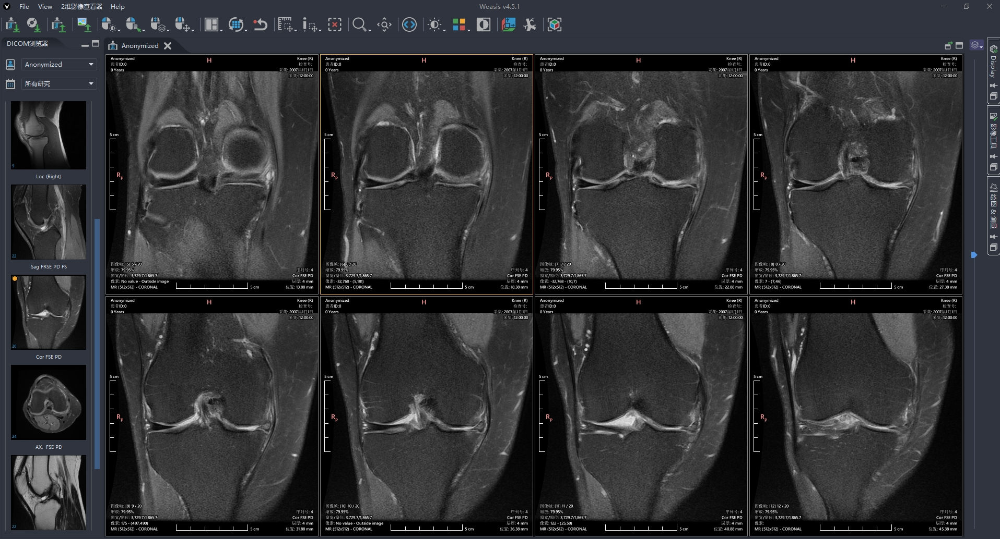
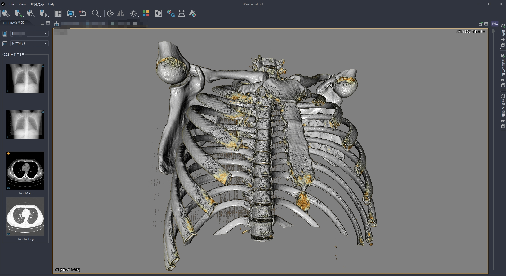
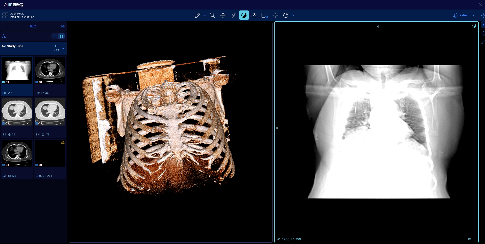
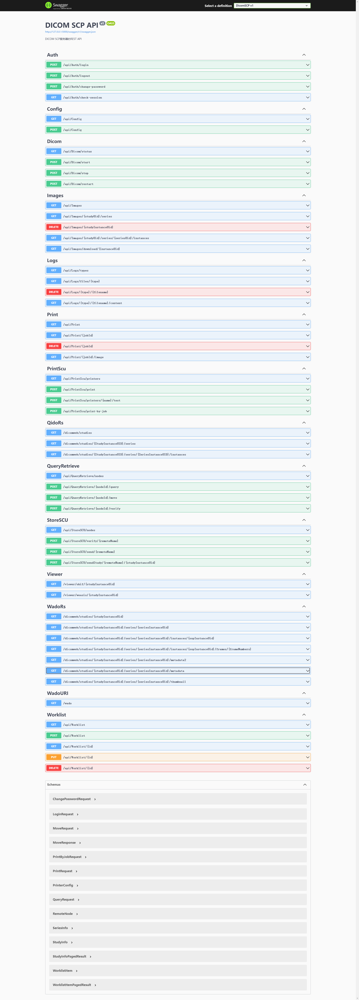

# DICOM 管理系统

## 携手Cursor重磅发布，打造中文开源社区最完善轻量PACS系统，医学影像必备DICOM工具箱!

- 基于 .NET Core 的 DICOM SCP（Service Class Provider）服务器，提供 DICOM 存储、工作列表、查询检索服务，打印服务，WADO/DicomWeb服务，集成了功能强大的DICOM 桌面和Web查看器。

- 项目支持跨平台，windows直接下载发布版本运行，linux直接使用docker部署。 weasis查看影像需要客户端电脑安装了才能调用。

- [项目Gitee仓库](https://gitee.com/fightroad/DicomSCP)

- [项目GitHub仓库](https://github.com/fightroad/DicomSCP)

## 支持项目

如果这个项目对您有帮助，欢迎赞助支持我们继续改进！

<table>
  <tr>
    <td align="center">
      
      <br/>
      微信赞助
    </td>
    <td align="center">
      
      <br/>
      支付宝赞助
    </td>
  </tr>
</table>

您的每一份支持都将帮助我们:
- 🚀 开发新功能
- 🐛 修复已知问题
- 📚 完善项目文档
- 🎨 优化用户体验

赞助时请备注您的 Gitee/GitHub ID，我们会将您添加到[赞助者名单](#赞助者)中。

## 功能预览






  
 
  
  
 
 
 
 

## 功能特性

- **存储服务 (C-STORE SCP)**
  - 按照4个级别的标签入库和归档
  - 按照级别标签自动组织存储目录结构
  - 支持 JPEG、JPEG2000、JPEG-LS、RLE 等压缩
  - 对不标准的字符集中文字符进行乱码处理

- **工作列表服务 (Worklist SCP)**
  - 提供标准 DICOM Modality Worklist 服务
  - 支持多种查询条件（患者ID、检查号、日期等）
  - 支持请求字符集协商自动中英文转换

- **查询检索服务 (QR SCP)**
  - 提供 C-FIND、C-MOVE、C-GET 服务
  - 可配置多个目标节点
  - 支持多种查询级别（Study/Series/Image）
  - 支持JPEG、JPEG2000、JPEG-LS、RLE 传输语法实时转码

- **打印服务 (Print SCP)**
  - 打印任务队列管理
  - 支持多种打印格式
  - 打印任务状态跟踪
  - 归档打印的原始文件和标签

- **WADOURI 服务 (Web Access to DICOM Objects)**
  - 必需参数
    - `requestType`: 必须为 "WADO"
    - `studyUID`: 研究实例 UID
    - `seriesUID`: 序列实例 UID
    - `objectUID`: 实例 UID

  - 可选参数
    - `contentType`: 返回内容类型 不传默认 image/jpeg
      - `application/dicom`: 返回 DICOM 格式
      - `image/jpeg`: 返回 JPEG 格式
    
    - `transferSyntax`: DICOM 传输语法 UID 不传默认不转码
      - `1.2.840.10008.1.2`: Implicit VR Little Endian
      - `1.2.840.10008.1.2.1`: Explicit VR Little Endian
      - `1.2.840.10008.1.2.4.50`: JPEG Baseline
      - `1.2.840.10008.1.2.4.57`: JPEG Lossless
      - `1.2.840.10008.1.2.4.70`: JPEG Lossless SV1
      - `1.2.840.10008.1.2.4.90`: JPEG 2000 Lossless
      - `1.2.840.10008.1.2.4.91`: JPEG 2000 Lossy
      - `1.2.840.10008.1.2.4.80`: JPEG-LS Lossless
      - `1.2.840.10008.1.2.5`: RLE Lossless

    - `anonymize`: 是否匿名化
      - `yes`: 执行匿名化处理
      - 其他值或不传: 不进行匿名化

  - 完整请求参数例子
    ```
    http://localhost:5000/wado?requestType=WADO&studyUID=1.2.840.113704.1.111.5096.1719875982.1&seriesUID=1.3.46.670589.33.1.13252761201319485513.2557156297609063016&objectUID=1.3.46.670589.33.1.39304787935332940.2231985654917411587&contentType=application/dicom&transferSyntax=1.2.840.10008.1.2.4.70&anonymize=yes
    ```

- **CSTORE-SCU (CSTORE-SCU)**
  - 支持发送DICOM图像到DICOM SCP
  - 可配置多个目标节点

- **Print-SCU (Print-SCU)**
  - 支持将PRINTSCP接收到的图像打印到其他打印机或PRINTSCP服务
  - 构建打印图像会保留原始图像的标签信息

- **Log Service (日志服务)**
  - 支持查看、下载、删除日志
  - 个服务日志独立配置
  - 多日志级别配置
  - 服务预置详细日志 方便对接查找问题

- **WADO-RS 服务 (Web Access to DICOM Objects - RESTful Services)**
  - 实例检索 (Instance Retrieval)
    ```
    GET /dicomweb/studies/{studyUID}
    GET /dicomweb/studies/{studyUID}/series/{seriesUID}
    GET /dicomweb/studies/{studyUID}/series/{seriesUID}/instances/{instanceUID}
    ```
    - 支持原始 DICOM 格式检索
    - 支持传输语法转换
    - 支持 multipart/related 响应
    - 支持 Accept 头指定返回格式
    - 支持检查/序列/实例三个级别的检索
    - 支持 transfer-syntax 参数指定传输语法

  - 元数据检索 (Metadata Retrieval)
    ```
    GET /dicomweb/studies/{studyUID}/series/{seriesUID}/metadata
    ```
    - 返回 DICOM JSON 格式
    - 包含完整的 DICOM 标签信息
    - 支持 VR 和 Value 的标准格式
    - 符合 DICOMweb 规范的空值处理

  - 帧检索 (Frame Retrieval)
    ```
    GET /dicomweb/studies/{studyUID}/series/{seriesUID}/instances/{instanceUID}/frames/{frames}
    ```
    - 支持单帧/多帧提取
    - 保持原始像素数据
    - 支持传输语法转换

  - 缩略图服务 (Thumbnail)
    ```
    GET /dicomweb/studies/{studyUID}/series/{seriesUID}/thumbnail?size={size}
    GET /dicomweb/studies/{studyUID}/series/{seriesUID}/thumbnail?viewport={viewport}
    ```
    - 支持自定义尺寸
      - size: 指定输出图像大小（可选，默认 128）
      - viewport: 指定视口大小（可选，与 size 参数互斥）
    - 保持图像宽高比
    - JPEG 格式输出
    - 示例：
      ```
      /dicomweb/studies/1.2.3/series/4.5.6/thumbnail?size=256
      /dicomweb/studies/1.2.3/series/4.5.6/thumbnail?viewport=512
      ```

- **QIDO-RS 服务 (Query based on ID for DICOM Objects - RESTful Services)**
  - 研究级查询 (Study Level Query)
    ```
    # DICOMweb 标准格式
    GET /dicomweb/studies?00100020={patientID}&00100010={patientName}&00080020={date}&00200010={accessionNumber}&0020000D={studyUID}&00080060={modality}&offset={offset}&limit={limit}&fuzzy=true
    
    # 友好格式（兼容）
    GET /dicomweb/studies?PatientID={patientID}&PatientName={patientName}&StudyDate={date}&AccessionNumber={accessionNumber}&StudyInstanceUID={studyUID}&Modality={modality}&offset={offset}&limit={limit}&fuzzy=true
    ```
    - 支持多种查询参数：
      - 标准 DICOM 标签格式：
        - 00100020: 患者 ID
        - 00100010: 患者姓名
        - 00080020: 检查日期
        - 00200010: 检查号
        - 0020000D: 检查实例 UID
        - 00080060: 检查类型/模态
      - 友好格式（等效）：
        - PatientID: 精确匹配或模糊匹配 (例如: "P123*" 匹配所有以 P123 开头的ID)
        - PatientName: 支持通配符 (例如: "*张*" 匹配包含"张"的姓名)
        - StudyDate: 支持日期范围 (例如: "20240101-20240131" 表示1月份的数据)
        - AccessionNumber: 检查号匹配
        - StudyInstanceUID: 检查实例 UID 精确匹配
        - Modality: 检查类型/模态 (例如: "CT" 或 "CT\MR" 支持多值)
        - fuzzy: 设置为 true 时启用模糊匹配
    - 支持分页功能（offset/limit）
    - 支持模糊匹配
    - 返回符合 DICOMweb 标准的 JSON 格式

  - 序列级查询 (Series Level Query)
    ```
    GET /dicomweb/studies/{studyUID}/series?SeriesInstanceUID={seriesUID}&Modality={modality}
    ```
    - 支持序列 UID 过滤
    - 支持模态过滤 (例如: "CT*" 匹配所有 CT 相关模态)
    - 返回序列详细信息
    - 符合 DICOMweb JSON 格式规范

  - 实例级查询 (Instance Level Query)
    ```
    GET /dicomweb/studies/{studyUID}/series/{seriesUID}/instances?SOPInstanceUID={instanceUID}
    ```
    - 支持 SOP 实例 UID 过滤
    - 返回实例详细信息
    - 包含图像参数信息

## 系统要求

- Windows 10/11 或 Windows Server 2016+
- .NET 8.0 或更高版本
- SQLite 3.x
- 4GB+ RAM
- 10GB+ 可用磁盘空间
- 现代浏览器（Chrome/Firefox/Edge）

## 快速开始

1. 下载最新发布版本
2. 修改 appsettings.json 配置文件
3. 运行 DicomSCP.exe
4. 访问 http://localhost:5000  
5. 默认账号 admin / admin

## Docker部署
appsettings.json需要先在宿主机目录下创建好！

```
docker run -d --name DicomSCP --restart unless-stopped \
  -p 5000:5000 \
  -p 11112-11115:11112-11115 \
  -v /opt/docker/dicomscp/keys:/root/.aspnet/DataProtection-Keys \
  -v /opt/docker/dicomscp/logs:/app/logs \
  -v /opt/docker/dicomscp/received_files:/app/received_files \
  -v /opt/docker/dicomscp/temp_files:/app/temp_files \
  -v /opt/docker/dicomscp/appsettings.json:/app/appsettings.json \
  -v /opt/docker/dicomscp/db:/app/db \
  fightroad/dicomscp:latest

```

## Nginx反向代理

```
proxy_pass http://127.0.0.1:5000;
proxy_set_header Host $host:$server_port;
proxy_set_header X-Forwarded-Proto $scheme;
proxy_set_header X-Real-IP $remote_addr;
proxy_set_header X-Forwarded-For $proxy_add_x_forwarded_for;
proxy_set_header REMOTE-HOST $remote_addr;
proxy_set_header Upgrade $http_upgrade;
proxy_set_header Connection "Upgrade";
proxy_http_version 1.1;
```

## 技术栈

- 后端框架：.NET Core
- 前端框架：原生 JavaScript
- DICOM 处理：fo-dicom、Cornerstone.js
- 数据库：SQLite
- HTTP 客户端：Axios
- UI 组件：Bootstrap

## 使用的开源项目

本项目使用了以下优秀的开源项目：

### 后端
- [fo-dicom](https://github.com/fo-dicom/fo-dicom) - Fellow Oak DICOM for .NET
- [Serilog](https://github.com/serilog/serilog) - 结构化日志框架
- [SQLite-net](https://github.com/praeclarum/sqlite-net) - 简单、强大的 SQLite 客户端

### 前端
- [Cornerstone.js](https://github.com/cornerstonejs/cornerstone) - 现代 Web DICOM 查看器
- [weasis](https://github.com/nroduit/Weasis) - DICOM桌面查看器
- [OHIF](https://github.com/OHIF/Viewers) - DICOM Web查看器
- [Axios](https://github.com/axios/axios) - 基于 Promise 的 HTTP 客户端
- [Bootstrap](https://github.com/twbs/bootstrap) - 前端组件库

感谢这些优秀的开源项目，让本项目得以实现！

## 赞助者

感谢以下赞助者的支持（排名不分先后）：

- **平凡之路**
- **QQ网名：生活  （感谢对项目的第一笔赞助！）**

## 参与贡献

我们非常欢迎您的贡献！如果您有任何想法或建议：

1. Fork 本仓库
2. 创建您的特性分支
3. 提交您的更改
4. 推送到分支
5. 打开一个 Pull Request

您也可以通过以下方式参与：
- 提交 Bug 报告
- 提出新功能建议
- 改进文档
- 分享使用经验

每一份贡献都将受到重视和感谢！

## 许可证

MIT License
